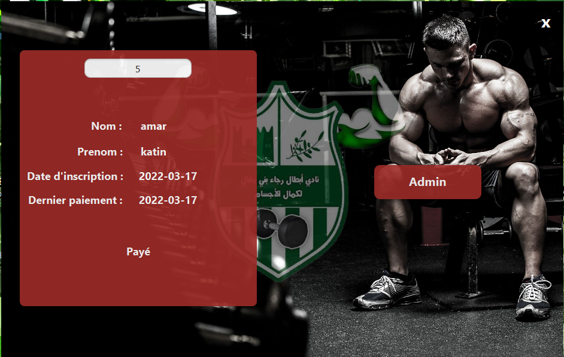
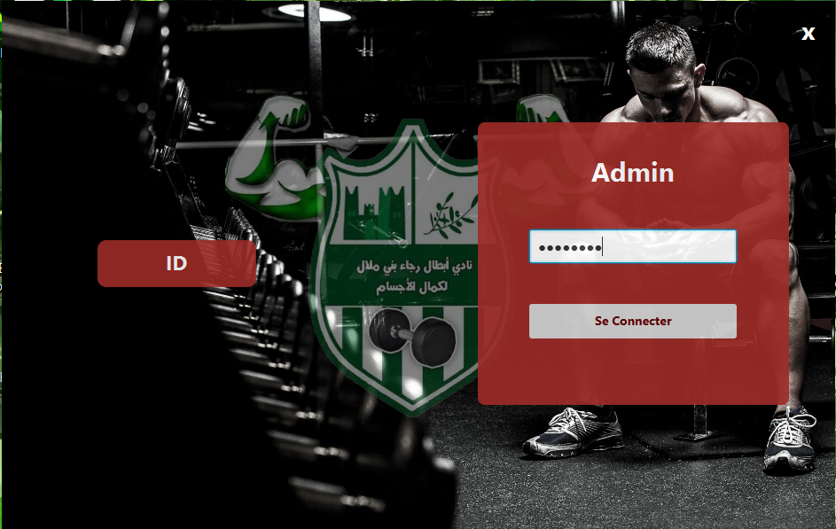
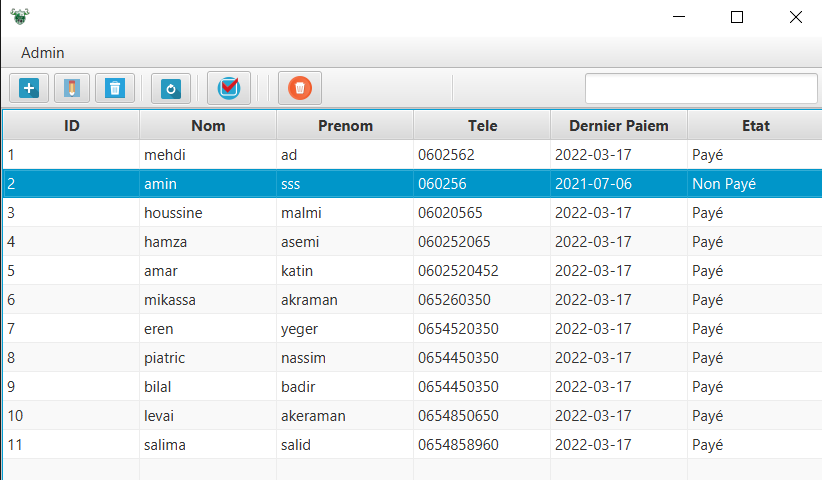
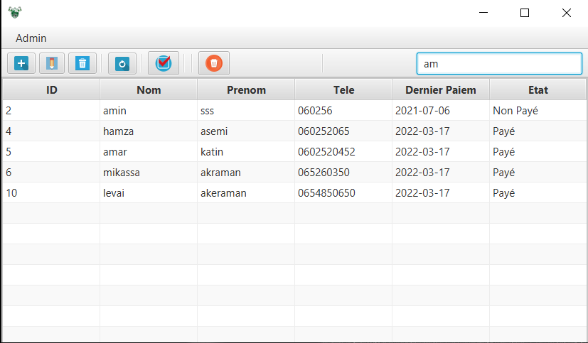

# MENOUALI GYM

- It is a desktop app developed using javaFX as a GYM subscriber management

## Installation & Configuration

After setting up your environment to jdk 1.8. you are almost done the only thing left is changing database informations connexion to yours. first you have to go to ConnexionDB.java by following the following path "src/models/ConnexionDB.java". secondly, change database name (menouali) to your database name , username (root) as well as the password (i left it empty because i don't use one)

## How to use

### Home page

### Login Page

### BackOffice

- It is the place where the manager can manage the memberships of all subscribers
  
  
